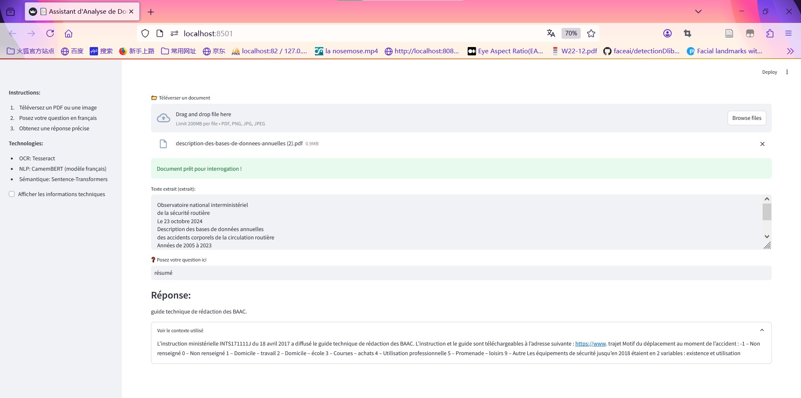

**Assistant_d'Analyse_de_Documents_2.1-2.3.ipynb** completes 2.1-2.3, avec un plateforme colab

**Assistant_d'Analyse_de_Documents.ipynb** completes 2.1-2.3, experimental environment python 3.11 (tools vs code) [spécifie explicitement les tokens, impose l'utilisation de SentencePiece et évite les erreurs de conversion tiktoken].

2.4 Interface utilisateur

Développer une interface web à l'aide d'un framework tel que Streamlit et permettez aux utilisateurs de télécharger des fichiers, de poser des questions et d'interagir avec l'assistant. Voici l'implémentation dans app.py. Après la précédente transformation du code, answer_question utilisait Camembert pour les questions-réponses, mais les phrases de réponse étaient trop courtes et pas assez précises. J'ai donc utilisé le modèle mistral de Hugging Face, augmenté la longueur des réponses et essayé plusieurs séries de réponses.

